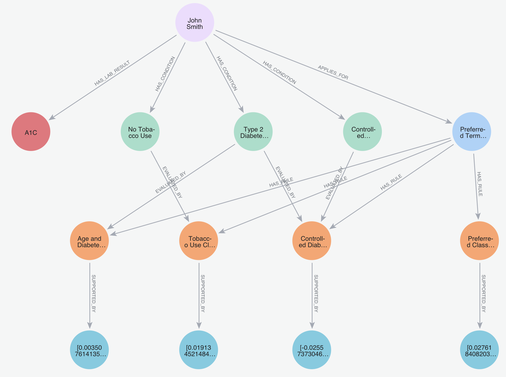
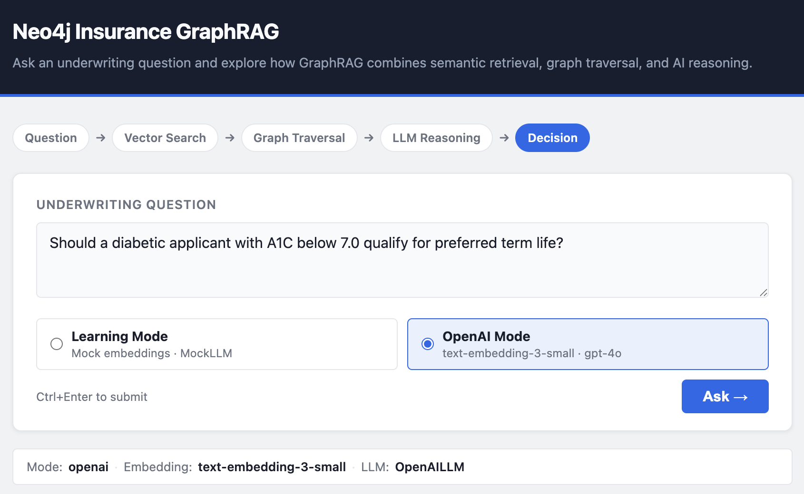
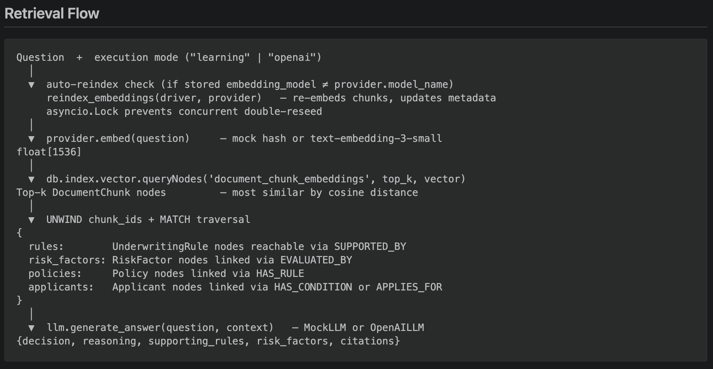
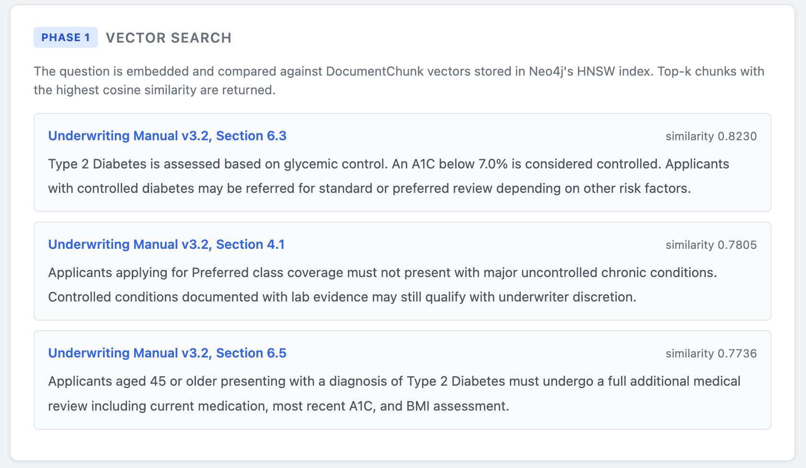
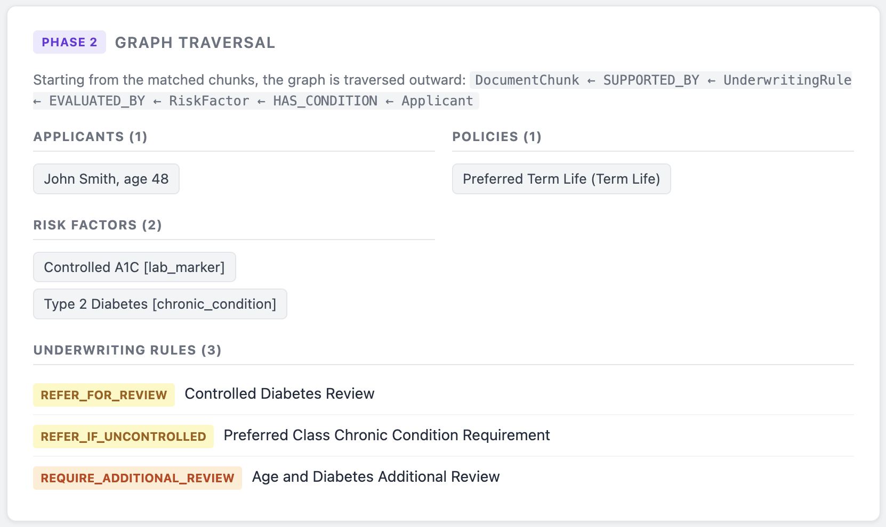
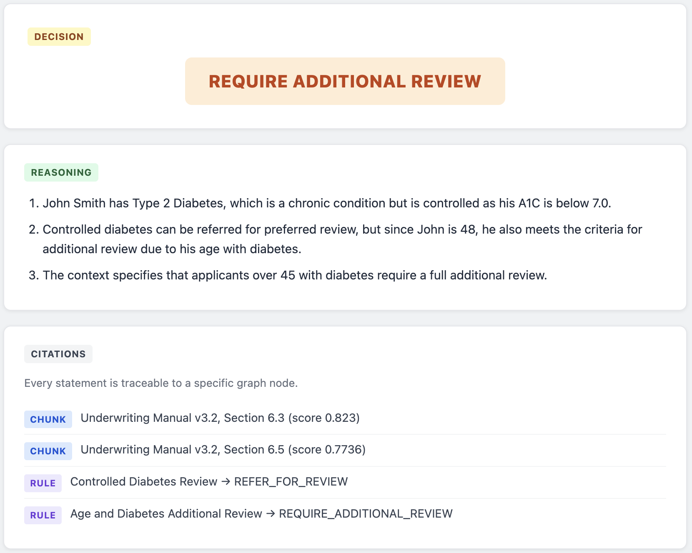

# Neo4j Insurance GraphRAG

A learning project demonstrating Graph-augmented Retrieval (GraphRAG) for insurance
underwriting, built step-by-step to understand the components of a production GraphRAG system.

**Stack:** Neo4j 5 · Python 3.11 · FastAPI · OpenAI · Neo4j Vector Indexes · Custom GraphRAG Pipeline

> **Two modes, one pipeline.** In **Demo Mode**, embeddings are mock (SHA-256 hash → float
> vector, not semantic) and decisions come from deterministic business logic — free, offline,
> and zero-cost. In **OpenAI Mode**, `text-embedding-3-small` embeddings and `gpt-4o` reasoning
> replace the mock components; the graph model, retrieval flow, and API contract are unchanged.
> Both modes are intentional: Demo Mode lets you understand the pipeline without any API
> dependency; OpenAI Mode shows the same pipeline running with production-grade providers.

---

## What This Demonstrates

- Modelling an insurance underwriting domain as a Neo4j knowledge graph
- Neo4j HNSW vector indexes for semantic similarity retrieval
- Two-phase retrieval: vector similarity search → structured graph traversal
- How graph context (rules, risk factors, policies, applicants) enriches what the LLM receives
- Why GraphRAG produces more explainable answers than flat vector RAG
- How to expose a retrieval pipeline as a typed, error-handled REST API

---

## Key Concepts Demonstrated

- **Neo4j Knowledge Graph Modeling** — six node types with typed relationships encoding underwriting domain logic
- **Vector Indexes (HNSW)** — Hierarchical Navigable Small World index for approximate nearest-neighbour search over 1536-dimension embeddings
- **GraphRAG Architecture** — vector retrieval and graph traversal as complementary, not competing, retrieval strategies
- **Vector Retrieval + Graph Traversal** — two-phase pipeline: HNSW similarity search followed by Cypher relationship traversal in one round-trip
- **Explainable AI with Citations** — every decision links back to specific graph nodes: manual sections, rules, risk factors
- **FastAPI Service Layer** — typed request/response models, lifespan-managed resources, structured error handling
- **Provider Pattern (Demo vs OpenAI)** — strategy pattern so the pipeline never checks which provider is active; `for_mode()` classmethod handles wiring
- **Embedding Consistency Validation** — stored `embedding_model` metadata detected and auto-reindexed when the mode changes
- **Graph-Based Context Enrichment** — LLM receives structured entities and relationships, not raw text paragraphs

---

## Why GraphRAG?

Standard RAG retrieves text chunks — it cannot tell you *which* applicant has *which* condition, or *which* rules govern that condition for a specific policy. That relational context lives in the graph, not in any single passage.

This system uses a two-phase approach:

1. **Vector search** — embed the question and find the most semantically relevant `DocumentChunk` nodes via Neo4j's HNSW index.
2. **Graph traversal** — walk outward from those chunks through `SUPPORTED_BY → UnderwritingRule → EVALUATED_BY → RiskFactor → HAS_CONDITION → Applicant` to assemble the full reasoning chain in one Cypher round-trip.

The LLM receives **structured entities and relationships**, not raw text paragraphs. Every fact in the answer traces back to a specific graph path — that is the explainability that matters in regulated industries like insurance.

---

## Why Neo4j Instead of Vector-Only RAG?

A pure vector store returns the most similar text passages. That is useful, but in a domain like insurance underwriting, the decision depends on *relationships*, not just text similarity:

- **Vector search** retrieves the most relevant underwriting manual sections (`DocumentChunk` nodes).
- **Graph traversal** follows `SUPPORTED_BY` edges from those chunks to `UnderwritingRule` nodes — the structured decision logic.
- Rules connect via `EVALUATED_BY` to `RiskFactor` nodes — the specific medical or lifestyle conditions being assessed.
- Risk factors connect via `HAS_CONDITION` to the `Applicant` — the person the question is actually about.
- The policy scope is recovered via `HAS_RULE → Policy ← APPLIES_FOR` — ensuring only rules for the correct product are considered.

No single text chunk contains all of this. A vector store would require multiple lookups and manual joining in application code. Neo4j traverses the entire chain in one Cypher query.

**What this adds over vector-only RAG:**

| Property | Vector-only RAG | GraphRAG (this project) |
|----------|----------------|------------------------|
| Retrieval unit | Text chunk | Graph path (chunk → rule → risk factor → applicant) |
| Entity awareness | Inferred from text | Explicit node properties |
| Scope | All similar text | Only rules for the relevant policy |
| Multi-hop reasoning | Not supported | Native — any depth via Cypher |
| Citations | Source document | Specific rule, risk factor, and manual section |
| Explainability | "The manual says…" | Traceable graph path per decision |

In regulated industries, the ability to reproduce *exactly* what the system saw — and which rule triggered which decision — is not a nice-to-have. Neo4j makes that auditability structural rather than bolted on.

---

## Architecture

```
POST /ask  {"question": "...", "mode": "demo" | "openai"}
      │
      ▼
FastAPI  app/main.py
      │  (lifespan: one Neo4j driver + two pipelines — demo and openai)
      │
      ├── Auto-reindex (if stored embedding model ≠ requested mode's provider)
      │     reindex_embeddings(driver, provider)   ← only updates vectors, not graph
      │     asyncio.Lock prevents concurrent double-reseed
      │
      ▼
GraphRAGPipeline  app/graphrag_pipeline.py
      │  (selected by mode: demo → MockEmbeddingProvider + MockLLM
      │                      openai → OpenAIEmbeddingProvider + OpenAILLM)
      │
      ├── Phase 1 — Vector search
      │     provider.embed(question) → db.index.vector.queryNodes()
      │     → top-k DocumentChunk nodes + similarity scores
      │
      └── Phase 2 — Graph traversal
            UNWIND chunk_ids
            MATCH (chunk)<-[:SUPPORTED_BY]-(rule)
            OPTIONAL MATCH (rf)-[:EVALUATED_BY]->(rule)
            OPTIONAL MATCH (p)-[:HAS_RULE]->(rule)
            OPTIONAL MATCH (a)-[:HAS_CONDITION]->(rf)
            → {rules, risk_factors, policies, applicants}
                    │
                    ▼
            llm.generate_answer()   ← MockLLM or OpenAILLM
            → {decision, reasoning, citations}
```

---

## Graph Model

```
(Applicant) -[:APPLIES_FOR]→    (Policy)
(Applicant) -[:HAS_CONDITION]→  (RiskFactor)
(Applicant) -[:HAS_LAB_RESULT]→ (LabResult)
(Policy)    -[:HAS_RULE]→       (UnderwritingRule)
(RiskFactor)-[:EVALUATED_BY]→   (UnderwritingRule)
(UnderwritingRule)-[:SUPPORTED_BY]→ (DocumentChunk)  ← embeddings live here
```

DocumentChunk nodes carry vector embeddings. UnderwritingRule nodes carry structured
decision logic. The graph connects them: vector search finds the chunk, traversal finds
the rule, rule links to the risk factor and applicant. No single text chunk contains all of this.

---

## Two Modes

Mode is selected **per request** in the browser UI (or via the `mode` field in the API).
The server pre-creates both pipelines at startup and switches between them automatically.

### Demo Mode (default — no API key needed)

Mock embeddings (SHA-256 hash) + MockLLM (deterministic business logic). Free, offline, instant.

Select **Demo** in the browser or pass `"mode": "demo"` in the request body.

### OpenAI Mode (requires `OPENAI_API_KEY`)

Real semantic embeddings (`text-embedding-3-small`) + `gpt-4o` reasoning over graph context.

```bash
# .env — only this is needed
OPENAI_API_KEY=sk-...
```

Select **OpenAI** in the browser or pass `"mode": "openai"` in the request body.

> **Auto-reindex:** Switching modes re-embeds all `DocumentChunk` nodes automatically on
> the first request in that mode — no manual `python3 -m app.seed` required.
> Only the embedding vectors are updated; the graph structure is unchanged.
> The first request after a mode switch takes a few extra seconds while re-indexing runs.

---

## How to Run

```bash
docker compose up -d
pip install -r requirements.txt
python3 -m app.seed          # initial graph setup only — run once
uvicorn app.main:app --port 8765 --reload
```

Then open **http://127.0.0.1:8765** in your browser for the interactive demo UI.

`python3 -m app.seed` is only needed once to populate the graph. Switching between Demo and
OpenAI mode in the UI re-indexes embeddings automatically — no manual re-seed required.

API docs (Swagger): http://127.0.0.1:8765/docs

> Ports 8000 and 8001 conflict with Docker on some machines — use 8765 or any free port.

---

## Browser Demo

The root URL (`/`) serves a single-page demo that visualises every pipeline step:

| Section | What it shows |
|---------|--------------|
| Mode selector | Choose Learning Mode (mock, free) or OpenAI Mode (real embeddings + gpt-4o) |
| Provider bar | Active embedding model and LLM class shown after every query |
| Auto-reindex notice (green) | Appears once when embeddings were automatically re-indexed for the selected mode |
| Embedding mismatch warning (amber) | Appears only if auto-reindex failed (e.g. network error during OpenAI call) |
| Phase 1 — Vector Search | Matched DocumentChunk nodes with source and similarity score |
| Phase 2 — Graph Traversal | Applicant, policies, risk factors, underwriting rules pulled from the graph |
| Final Decision | Colour-coded badge (APPROVE / REFER\_FOR\_REVIEW / REQUIRE\_ADDITIONAL\_REVIEW / DECLINE) |
| Reasoning | Numbered explanation from the LLM |
| Citations | Each DocumentChunk source and UnderwritingRule that supported the decision |

No React. No build step. Plain HTML + CSS + JavaScript served by FastAPI.

---

## Screenshots

### 1. Knowledge Graph Model



Insurance underwriting knowledge graph showing applicants, policies, risk factors, underwriting rules, lab results, and supporting document evidence.

### 2. Interactive GraphRAG Application



Browser-based GraphRAG application supporting Learning Mode with mock providers and OpenAI Mode with text-embedding-3-small and gpt-4o.

### 3. Retrieval Flow



End-to-end GraphRAG pipeline from question to embedding generation, Neo4j HNSW vector search, graph traversal, reasoning, and final decision.

### 4. Phase 1 – Vector Search



Question embedding is compared against Neo4j HNSW vector indexes to retrieve the most relevant underwriting document chunks.

### 5. Phase 2 – Graph Traversal



Matched document chunks are expanded through graph relationships to retrieve applicants, policies, risk factors, and underwriting rules.

### 6. Explainable Decision & Citations



Grounded recommendation with transparent reasoning and traceable citations to both source documents and underwriting rules.

---

## Sample Request (curl)

```bash
# Demo mode (default — no API key required)
curl -X POST http://127.0.0.1:8765/ask \
  -H "Content-Type: application/json" \
  -d '{"question":"Should a diabetic applicant with A1C below 7.0 qualify for preferred term life?","mode":"demo"}'

# OpenAI mode (requires OPENAI_API_KEY in .env)
curl -X POST http://127.0.0.1:8765/ask \
  -H "Content-Type: application/json" \
  -d '{"question":"...","mode":"openai"}'
```

**Response:**

```json
{
  "question": "Should a diabetic applicant with A1C below 7.0 qualify for preferred term life?",
  "decision": "REFER_FOR_REVIEW",
  "reasoning": [
    "Type 2 Diabetes is present in the applicant's risk profile — a chronic condition that triggers mandatory underwriting review.",
    "A1C is controlled (below 7.0 threshold) — the condition is actively managed, which favourably adjusts the severity assessment.",
    "Preferred class requires underwriting review for any chronic condition, even when controlled.",
    "No tobacco use is recorded, which provides a favourable lifestyle adjustment to the overall risk profile."
  ],
  "supporting_rules": [
    {"id": "rule_002", "title": "Controlled Diabetes Review",        "decision": "REFER_FOR_REVIEW"},
    {"id": "rule_003", "title": "Tobacco Use Classification",        "decision": "APPROVE_FACTOR"}
  ],
  "risk_factors": [
    {"name": "Type 2 Diabetes", "category": "chronic_condition"},
    {"name": "Controlled A1C",  "category": "lab_marker"},
    {"name": "No Tobacco Use",  "category": "lifestyle"}
  ],
  "citations": [
    {"type": "DocumentChunk",    "source": "Underwriting Manual v3.2, Section 6.3", "relevance_score": 0.506},
    {"type": "DocumentChunk",    "source": "Underwriting Manual v3.2, Section 6.5", "relevance_score": 0.513},
    {"type": "UnderwritingRule", "title": "Controlled Diabetes Review",              "decision": "REFER_FOR_REVIEW"}
  ],
  "retrieval_summary": {
    "matched_chunks": 3,
    "rules": 3,
    "risk_factors": 3,
    "policies": 1,
    "applicants": 1
  },
  "mode": "demo",
  "embedding_provider": "mock",
  "llm_provider": "MockLLM",
  "compatibility_warning": null,
  "reindexed": false
}
```

---

## Run Without the API

```bash
python3 -m app.graphrag_pipeline
```

---

## Endpoints

| Method | Path     | Description                          |
|--------|----------|--------------------------------------|
| GET    | /health  | Liveness check                       |
| POST   | /ask     | Submit a question, get a GraphRAG answer |

Interactive docs (Swagger UI): `http://127.0.0.1:8765/docs`

**Error codes:**

| Code | Cause                              |
|------|------------------------------------|
| 400  | `question` field is blank          |
| 503  | Neo4j is unreachable               |
| 500  | Unexpected server error            |

---

## Components — Demo Mode vs OpenAI Mode

| Component     | Demo Mode (default)                         | OpenAI Mode                              |
|---------------|---------------------------------------------|------------------------------------------|
| Embeddings    | SHA-256 hash → float[1536] (not semantic)   | `text-embedding-3-small` (semantic)      |
| LLM           | Deterministic Python business logic         | `gpt-4o` reasoning over graph context   |
| Data          | 1 applicant, 4 rules, 4 document chunks     | Same — data is provider-agnostic         |
| Cost          | Zero                                        | OpenAI API charges apply                 |

Switch modes using the selector in the browser UI or the `mode` field in the API request.
Embeddings are re-indexed automatically on the first request in a new mode.
The graph model, traversal queries, and API contract are identical in both modes.

---

## Production Evolution

1. **OpenAI mode is already implemented** — set `OPENAI_API_KEY` in `.env` and select
   OpenAI Mode in the browser. Embeddings re-index automatically on the first request.
   The graph model and API contract are unchanged.
2. **Scale** — the schema supports any number of applicants, policies, and rules. Retrieval
   performance scales with Neo4j's HNSW index, not data volume.
3. **Auth + observability** — add `Depends()` middleware for API key or JWT auth. Log
   `retrieval_summary` counts to detect retrieval quality drift over time.
4. **Additional LLM providers** — add any new LLM class following the same interface as
   `MockLLM` and `OpenAILLM`. No pipeline changes required.

---

## Why I Built This

I built this project as a hands-on exercise to understand GraphRAG from the inside — not by using a library that abstracts the pipeline, but by building each layer separately so I could explain what it does and why.

**Learning goals:**

- **Neo4j graph modeling** — how to represent a relationship-heavy domain as a property graph rather than a flat schema
- **GraphRAG architecture** — how vector retrieval and graph traversal complement each other, and why the combination outperforms either alone
- **Vector retrieval** — how HNSW indexes work, how embeddings are stored and queried, and what similarity scores mean in practice
- **Graph traversal** — writing multi-hop Cypher queries and understanding why one round-trip is better than multiple lookups
- **Explainable AI workflows** — building a citation chain where every part of the answer traces to a specific source in the graph
- **Graph databases as RAG infrastructure** — understanding why a graph store provides structural advantages over a vector-only store for relationship-heavy domains

Insurance underwriting was a deliberate choice: the domain is relationship-heavy (applicant → condition → rule → policy), the decision logic is concrete enough to validate that retrieval is actually working, and explainability requirements mirror what regulated industries genuinely need.

---

## Topics Explored

Building this project provided hands-on experience with:

- **Knowledge Graph Modeling** — designing a property graph schema for a relationship-heavy domain; choosing which facts belong on nodes vs. relationships
- **Cypher Graph Traversal** — multi-hop `MATCH` and `OPTIONAL MATCH` queries; batching via `UNWIND` to minimise round-trips
- **Neo4j HNSW Vector Indexes** — creating and querying an HNSW approximate nearest-neighbour index; understanding what similarity scores mean in practice
- **GraphRAG Architecture** — combining vector retrieval and graph traversal so each phase handles what it does best
- **Vector Retrieval** — embedding text, storing vectors as node properties, querying via `db.index.vector.queryNodes()`
- **Graph-Based Context Enrichment** — traversing from retrieved chunks to connected rules, risk factors, applicants, and policies in one query
- **Explainable AI** — building citations that trace every decision back to a specific graph node rather than a raw text passage
- **OpenAI Embeddings (`text-embedding-3-small`)** — calling the embeddings API, storing results in Neo4j, and handling model/vector consistency across requests
- **LLM Grounding and Citations** — using `gpt-4o` with JSON mode over structured graph context; normalising response shapes across providers
- **FastAPI Service Design** — lifespan-managed resources, typed Pydantic models, async request handling with `asyncio.to_thread()`
- **Provider Abstraction Pattern** — strategy pattern so the pipeline is provider-agnostic; `for_mode()` classmethod handles all wiring
- **Embedding Consistency Validation** — detecting stored vs. active embedding model mismatches and auto-reindexing before the query runs

---

## GitHub Repository Metadata

Recommended values for GitHub repository settings (copy directly):

**Description:**
```
Insurance underwriting GraphRAG reference implementation using Neo4j, vector search, graph traversal, OpenAI embeddings, and explainable AI citations.
```

**Topics:**

- neo4j
- graphrag
- graph-database
- knowledge-graph
- rag
- vector-search
- hnsw
- openai
- fastapi
- python
- genai

---

## Project Structure

```
static/
  index.html            — single-page demo UI
  styles.css            — no external CDN dependencies
  app.js                — fetch /ask, render each pipeline section
app/
  config.py             — Neo4j connection settings (dotenv)
  graph.py              — driver factory + run_query helper
  embed.py              — mock embedding: SHA-256 hash → float[1536]
  seed.py               — constraints, seed nodes/relationships, attach embeddings; reindex_embeddings() for auto mode switching
  vector_index.py       — create/verify HNSW vector index, similarity_search()
  graph_retriever.py    — GraphRetriever: two-phase vector + graph retrieval
  mock_llm.py           — MockLLM: deterministic underwriting decision logic
  graphrag_pipeline.py  — GraphRAGPipeline: retriever → LLM → structured answer
  main.py               — FastAPI app: POST /ask, GET /health, error handling
data/
  underwriting_sample.json  — seed data source of truth (all nodes + relationships)
ARCHITECTURE.md             — detailed design notes
LEARNING_NOTES.md           — step-by-step theory + design Q&A
CYPHER_QUERIES.md           — Cypher reference queries for each retrieval phase
```
